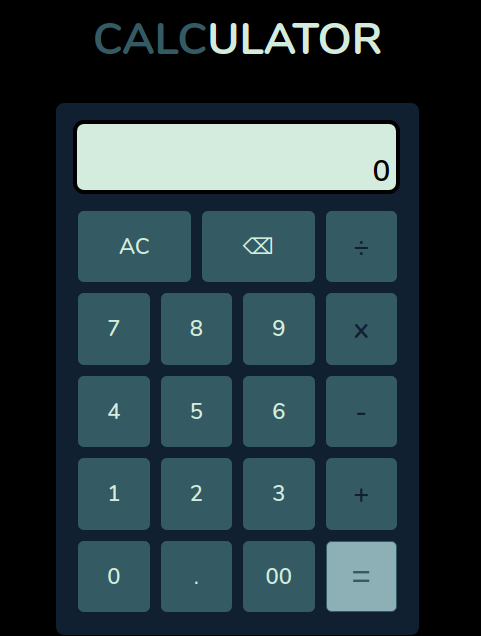

# Calculator

[click here](https://lemonaisu888.github.io/calculator) for live preview!

It contains features for 4 basic math operators: add, substract, multiply, and divide. I built my own functions instead of using eval() or anything that do all the math works, so **I was being challenged a lot in this project!**

## Technologies I Used
* OS: Linux Ubuntu
* Editor: VS Code
* Source control provider: GitHub
* Tech stack:
    * HTML
    * CSS
    * JavaScript

## Outcomes
* Deepened knowledge in conditional statements, functions, and HTML DOM.
* Learned how to use array method. In this project, I used `slice(0, -1)` for the backspace feature to remove the last character.
* It was also a great practice for my CSS skills :)
